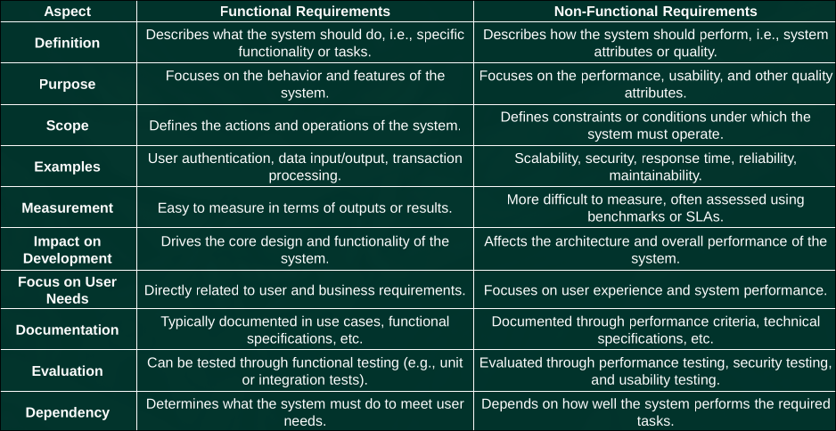

# Software eng
---
## Define functional and non functional requirements.

> Functional requirements

- These define what the system should do.

- Functional requirements specify the core functions and behavior of the system.

- A functional requirement defines what a system is supposed to do. It describes the
specific functionality, behavior, or tasks the system should perform to meet the user's needs.

- These requirements focus on the features and operations of the system.

> Non Functional requirements 

-  These define how the system should perform or other system constraints.

- Non-functional requirements specify the quality attributes of the system.

- A non-functional requirement (NFR) defines the quality attributes, performance, or
constraints of a software system rather than its specific behavior or functionality. It
describes how the system should operate and addresses areas like performance, security,
usability, reliability, scalability, and more.

---
## Write down any 6 key differences between functionsl and non funcional requirements

---

## explain requirement engineering process

- The Requirements Engineering Process is a systematic approach to identifying,
documenting, and managing the needs and expectations of stakeholders for a
software system or product.

- It ensures that the final system meets the intended purpose and aligns with business
objectives.

---

## explain requirement elicitation process

